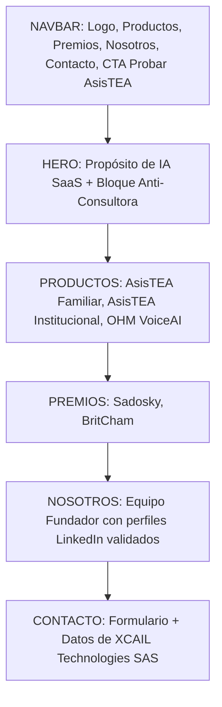

# Informe de Postulación y Requisitos de Aprobación para Google for Startups Cloud Program

Este documento sirve como análisis de contexto, diagnóstico técnico y especificación de diseño para la reestructuración de la web de **XCAIL Technologies** (https://xcail.com). El objetivo es superar las auditorías del programa de créditos de **Google Cloud for Startups** ($2,000 USD iniciales) y asegurar una aprobación directa en la próxima postulación.

Este informe está diseñado para servir de contexto completo y detallado para cualquier modelo de Inteligencia Artificial (como Gemini o Claude) que se encargue de realizar los cambios en la base de código.

---

## 1. Contexto de la Postulación y Rechazos de XCAIL

### Postulación Inicial (Mayo 2026)
* **Correo de aplicación:** `tech@xcail.com` (correo corporativo).
* **Identidad comercial:** XCAIL Technologies SAS.
* **Productos principales presentados:** 
  * **AsisTEA** (https://asistea.app): Plataforma de Inteligencia Artificial Generativa diseñada para familias, profesionales e instituciones en el ámbito del neurodesarrollo.
  * **OHM VoiceAI**: MVP en desarrollo de comunicación asistida mediante IA para personas con limitaciones motoras o del habla.

### Primer Rechazo (19 de Mayo de 2026)
* **Causa indicada:** Google identificó a la empresa como una **consultora, agencia, empresa de servicios o negocio tradicional**, figuras que no son elegibles para el programa (el cual exige ser una startup en fase inicial orientada a producto tecnológico propio y escalable).
* **Acción de respuesta:** Se envió una aclaración por correo electrónico el mismo día, argumentando que:
  * El foco principal de XCAIL es el desarrollo de productos de IA propios (SaaS) y no la consultoría.
  * AsisTEA está activa, desplegada en Google Cloud y consume servicios clave (Firebase y Gemini API).
  * La startup cuenta con validación institucional (Premios Sadosky 2025 y BritCham Argentina).

### Segundo Rechazo (1 de Junio de 2026)
* **Causa indicada:** El equipo de Google determinó que no se pudo validar el requisito de contar con una **web pública y global que demuestre de forma clara un modelo de negocio digital-nativo (SaaS)**. Específicamente, declararon:
  * Falta de detalles públicos claros sobre el **negocio**, el **equipo detrás del proyecto** y el **producto real** en el sitio web corporativo.
  * Rechazo de la postulación por no poder comprobar la tangibilidad o el modelo comercial.
  * Se indicó que no evalúan prototipos bajo login ni pitch-decks en PDF; toda la información debe estar expuesta públicamente en la URL de postulación.

---

## 2. Análisis de Requisitos del Auditor de Google Cloud

A partir de la retroalimentación de Google y los casos de éxito documentados por fundadores en la comunidad (como Reddit), se identifican los siguientes criterios y restricciones rígidas que aplican los auditores del programa:

### 2.1. Reglas Operativas del Auditor
1. **Validación exclusiva por URL pública:** Los evaluadores tienen estrictamente prohibido registrarse en la aplicación, ingresar detrás de muros de login, examinar archivos PDF adjuntos o evaluar prototipos privados. Si la landing page principal no muestra el producto, para el auditor el producto **no existe**.
2. **Rechazo automático a consultoras y agencias:** Cualquier indicio de servicios profesionales a terceros, desarrollo de software a medida, consultoría de TI o modelo de "Software Factory" invalida inmediatamente la postulación.
3. **El "Modo Sigilo" (Stealth Mode) requiere financiamiento VC:** Las startups que ocultan su producto solo son aprobadas si cuentan con respaldo de firmas de Venture Capital conocidas y pueden proveer un punto de contacto (POC) de sus inversores para verificación directa. Si se autofinancian (bootstrap) o están en fase semilla sin VC institucional, **deben ser 100% transparentes en su web**.
4. **Infraestructura Administrativa:** Es mandatorio que el dominio de correo (`@xcail.com`) esté enlazado a una cuenta de Google Workspace activa y que exista una cuenta de facturación configurada en Google Cloud. El uso de gestores de correo externos (como Zoho) o genéricos (como Gmail) suele generar rechazos administrativos iniciales por la imposibilidad de vincular la consola de facturación correctamente.

### 2.2. Los 4 Pilares de Aprobación Exigidos en la Web

| Pilar | Requisito de Google | Implementación Necesaria en XCAIL |
| :--- | :--- | :--- |
| **1. Identidad Institucional** | Sección "Nosotros" / "About Us" detallada. Identificar claramente quiénes están detrás del proyecto. | Listar fundadores y roles. Enlace obligatorio a perfiles de LinkedIn de los fundadores. |
| **2. Reciprocidad en LinkedIn** | Validación de identidad y autenticidad del equipo. | Los perfiles de LinkedIn de los fundadores deben reflejar la experiencia actual en XCAIL Technologies e incluir un enlace recíproco a `xcail.com`. |
| **3. Tangibilidad del Producto** | Demostrar que hay tecnología real construida y no solo una idea descriptiva. | Exponer capturas de pantalla de alta fidelidad de la interfaz (dashboard, agendas, reportes de AsisTEA), flujos de trabajo de la IA y videos demo (como el barrido de OHM VoiceAI). |
| **4. Claridad de Negocio SaaS** | Explicación del problema, mercado objetivo y modelo de monetización digital-nativo. | Mostrar explícitamente los planes comerciales (SaaS), precios, qué incluye cada suscripción (Familiar vs. Institucional), y el stack de infraestructura cloud utilizado. |

---

## 3. Diagnóstico del Sitio Web Actual de XCAIL vs. Requisitos

Al inspeccionar los componentes actuales de la aplicación (`src/components/About.tsx`, `src/components/Solutions.tsx`, y `src/components/Hero.tsx`), se identifican las siguientes debilidades críticas:

1. **Terminología de Agencia/Consultoría (Bloque "Sobre XCAIL" y "Capacidades"):**
   * El sitio actual tiene tarjetas que destacan: *"Ingeniería de Software (arquitecturas escalables y resilientes)"*, *"Analítica Avanzada"* y *"Gobernanza de Datos"*. 
   * **Problema:** Para un auditor externo de Google, esta estructura se asemeja al portafolio de una empresa de desarrollo web a medida o una consultora tecnológica, lo que justifica la etiqueta de "Software Factory".
2. **Falta de Evidencia Visual de Producto:**
   * La sección `Solutions.tsx` solo muestra un logotipo de AsisTEA y tres párrafos de texto explicativo con un enlace externo a `asistea.app`. 
   * **Problema:** El auditor no hace clic en enlaces externos para registrarse. La web de XCAIL debe "vender" el producto internamente mediante capturas de pantalla estructuradas que muestren cómo funciona.
3. **Ausencia de Modelo de Negocio (SaaS Pricing):**
   * No hay ninguna tabla de precios ni mención a planes, suscripciones SaaS o licenciamiento.
   * **Problema:** Al no mostrar planes de monetización (por ejemplo, plan familiar vs. licencias institucionales), Google interpreta que es un servicio sin un modelo comercial nativo-digital escalable.
4. **Ausencia de OHM VoiceAI y su MVP:**
   * La web actual no menciona a OHM VoiceAI, perdiendo la oportunidad de demostrar un segundo producto de accesibilidad que consume IA intensiva.
5. **Enlaces de Validación Incompletos:**
   * La sección de Nosotros (`About.tsx`) menciona a Carlos Ezequiel Leiva pero carece de un enlace directo y visible a su LinkedIn profesional.

---

## 4. Plan de Acción y Estructura Definitiva para la Web de XCAIL

Para corregir estas debilidades y asegurar la aprobación, se debe reestructurar la landing page utilizando el siguiente esquema y contenido de alta conversión y cumplimiento regulatorio:

### 4.1. Navbar (`Navbar.tsx`)
* **Estructura:** Logo de XCAIL, links de navegación (Inicio, Productos, Premios, Nosotros, Contacto), selector de idioma (ES/EN) y un botón destacado (CTA) con el texto: **"Probar AsisTEA Beta"**.
* **Comportamiento:** Sticky con fondo translúcido (glassmorphism) al hacer scroll.

### 4.2. Hero Section (`Hero.tsx`)
* **Headline principal:** *«Construimos productos de inteligencia artificial para neurodesarrollo y accesibilidad.»*
* **Subheadline:** *«Desarrollamos herramientas digitales para familias, profesionales e instituciones que acompañan a personas neurodivergentes mediante inteligencia artificial, automatización y tecnología accesible.»*
* **Badges Tecnológicos:** Neurodesarrollo, Inteligencia Artificial, Accesibilidad, Cloud Native.
* **CTAs:** Botón principal *"Probar AsisTEA Beta"* y botón secundario *"Explorar Productos"*.
* **Bloque Anti-Consultora (Crítico):**
  > **Productos tecnológicos propios diseñados para escalar.**  
  > En XCAIL desarrollamos plataformas digitales impulsadas por inteligencia artificial e infraestructura cloud, enfocadas en neurodesarrollo, accesibilidad y autonomía. Nuestro enfoque está centrado exclusivamente en productos SaaS propios y tecnología aplicada de impacto real.

### 4.3. Productos y Planes (`Solutions.tsx` / `Products.tsx`)
Esta sección debe rediseñarse por completo. Se presentará en un diseño de **3 tarjetas de producto / SaaS** con un bloque técnico de cierre.

#### Tarjeta 1: AsisTEA Familiar (SaaS B2C)
* **Badge:** `🟢 Beta Pública Próximamente`
* **Título:** AsisTEA Familiar — Acompañamiento inteligente para familias y cuidadores.
* **Descripción:** Plataforma para organizar rutinas estructuradas, generar guías de apoyo diario asistidas por IA y llevar un registro de evolución del neurodesarrollo.
* **Características:** Agendas visuales y rutinas, recomendaciones contextuales de IA, registro de observaciones y coordinación con terapeutas.
* **Elementos Visuales:** Carousel de capturas de pantalla reales (Dashboard, Agenda Visual, Generador de Guía por IA, Gráfico de Evolución).
* **Modelo de Negocio:** Suscripción mensual / Plan Gratis con funciones Plus de pago (SaaS).
* **CTA:** *"Probar AsisTEA Beta"*.

#### Tarjeta 2: AsisTEA Institucional (SaaS B2B)
* **Badge:** `🟠 Pilotos Institucionales`
* **Título:** AsisTEA Institucional — Gestión colaborativa para salud, educación y centros de apoyo.
* **Descripción:** Extensión multiusuario para coordinar equipos terapéuticos, organizar historias de evolución y centralizar el seguimiento del paciente.
* **Características:** Coordinación interdisciplinaria, paneles de control multiusuario, reportes y trazabilidad de objetivos, almacenamiento escalable en la nube.
* **Elementos Visuales:** Mockups del panel institucional y de los reportes consolidados.
* **Modelo de Negocio:** Licenciamiento institucional (B2B SaaS) con cotización personalizada.
* **CTA:** *"Solicitar Piloto"*.

#### Tarjeta 3: OHM VoiceAI (Accesibilidad / Deep Tech)
* **Badge:** `🟠 MVP Funcional en Desarrollo`
* **Título:** OHM VoiceAI — Comunicación asistida impulsada por IA para mayor autonomía.
* **Descripción:** Solución de accesibilidad que permite la comunicación a personas con parálisis motora mediante sensores de mirada o guiño, sintetizando texto a voz natural y sugiriendo palabras por IA contextual.
* **Características:** Barrido de teclado predictivo, síntesis de voz natural (TTS), procesamiento de señales mínimas y compatibilidad con hardware accesible.
* **Elementos Visuales (Mandatorio para Google):** Un reproductor de video demo corto (20-30 seg) que muestre el flujo del MVP (Detección de parpadeo -> Selección de letras -> Predicción de IA -> Voz generada).
* **Modelo de Negocio:** Lista de espera para validación clínica y acceso anticipado.
* **CTA:** *"Solicitar Acceso Anticipado"*.

#### Bloque Técnico de Cierre de Sección
Para reforzar la integración cloud con Google Cloud ante el auditor:
* **Infraestructura Cloud Native:** Detallar el stack tecnológico utilizado que justifica la solicitud de créditos:
  * *Modelos de IA:* Gemini API para la generación de guías y texto predictivo.
  * *Backend & Auth:* Firebase Auth, Firestore y Cloud Functions.
  * *Infraestructura:* Google Cloud Storage, hosting escalable y computación en la nube segura.

### 4.4. Premios y Reconocimientos (`Awards.tsx`)
* **Objetivo:** Dar credibilidad y validar que no es una empresa fantasma.
* **Premios a destacar:**
  * **Premio Sadosky (Finalista 2025):** Reconocimiento nacional a la innovación tecnológica.
  * **Cámara de Comercio Británica (BritCham):** Reconocimiento al impacto social y tecnológico.

### 4.5. Nosotros (`About.tsx`)
* **Redacción de Identidad:** Startup enfocada en el desarrollo de productos de IA para accesibilidad y neurodivergencia.
* **Información del Fundador (Crítico):**
  * **Nombre:** Carlos Ezequiel Leiva.
  * **Rol:** Fundador & CEO.
  * **Biografía:** Breve perfil centrado en tecnología de impacto, inteligencia artificial y desarrollo de productos.
  * **Enlace a LinkedIn:** Botón prominente de *"Ver LinkedIn"*.
  * *(Nota extra-web: Carlos debe editar su LinkedIn para que su empleo actual sea "Founder & CEO en XCAIL Technologies", enlazando al perfil de empresa de XCAIL, el cual a su vez debe enlazar a xcail.com).*

### 4.6. Contacto e Información Legal (`Contact.tsx` y `Footer.tsx`)
* **Formulario:** Modificar los campos del formulario para incluir el campo "Organización/Institución", demostrando un enfoque comercial SaaS.
* **Información Corporativa:** Explicitar los datos fiscales y de contacto de la sociedad para generar confianza institucional:
  * **Razón Social:** XCAIL Technologies SAS.
  * **Email Corporativo:** `contacto@xcail.com` (o `tech@xcail.com`).
  * **Ubicación:** Buenos Aires, Argentina.
* **Footer:** Enlaces a Política de Privacidad, Términos y Condiciones, y LinkedIn Corporativo.

---

## 5. Directrices de Implementación para el Desarrollador/IA

Al momento de programar estos cambios sobre el proyecto React/Vite/TS/Tailwind:

1. **Mantener una estética ultra-premium (Dark Mode / Glassmorphism):**
   * Usar degradados sutiles (`from-[#00BFFF] to-[#0099CC]`, `from-[#D4AF37] to-[#fca311]`).
   * Componentes limpios basados en `shadcn/ui` (tarjetas, botones, carousels).
   * Animaciones suaves en los carousels de producto y al hacer hover en las tarjetas de planes.
2. **Copywriting Orientado Exclusivamente a Producto:**
   * Reemplazar palabras como "servicios", "consultoría", "desarrollo a medida" o "capacidades" por terminología de software: "plataforma", "SaaS", "producto propio", "infraestructura cloud", "licenciamiento".
3. **Imágenes y Recursos de Apoyo (Mockups):**
   * Usar capturas reales de la interfaz de AsisTEA o recrear mockups de alta fidelidad.
   * Evitar a toda costa imágenes genéricas de stock (especialmente de médicos o terapeutas sonrientes) ya que restan tangibilidad técnica. Utilizar gráficos abstractos de tecnología, capturas del panel de control de la app o diagramas de arquitectura.
4. **Verificación Técnica de Formularios:**
   * Garantizar que el formulario de contacto funcione correctamente y esté integrado con el backend (por ejemplo, el archivo `server.cjs` provisto en el proyecto) para demostrar que la web no es solo un cascarón estático, sino una landing conectada a un servidor real.

Este informe sienta las bases estratégicas y de diseño para actualizar la web de XCAIL Technologies y garantizar una postulación exitosa y aprobada por los auditores de Google Cloud Startups.
